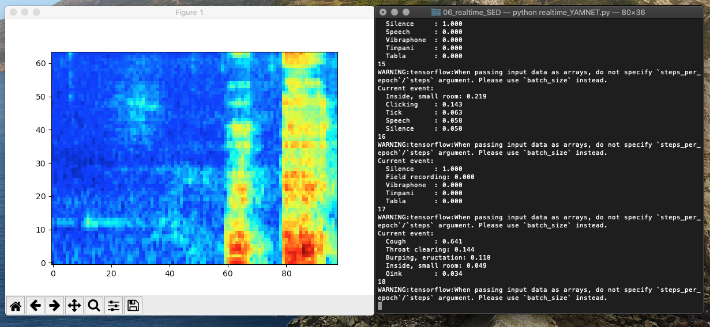

# realtime_YAMNET
Simple real-time Sound Event Detector based on [YAMNet](https://github.com/tensorflow/models/tree/master/research/audioset/yamnet) and pyaudio.  
This is a toy project for SED, which you can analyze sound events with your own laptop mic in every second.  
The system shows the top five among the 521 target events.  

Before you start, pretrained model weights for YAMNet are required.  
[Download](https://storage.googleapis.com/audioset/yamnet.h5) and put it in the yamnet folder.


```
python realtime_YAMNET.py
```


Have fun.
